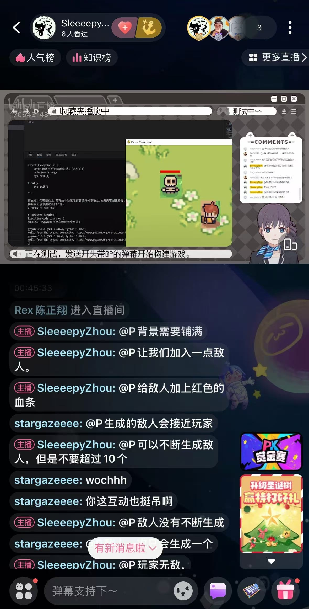
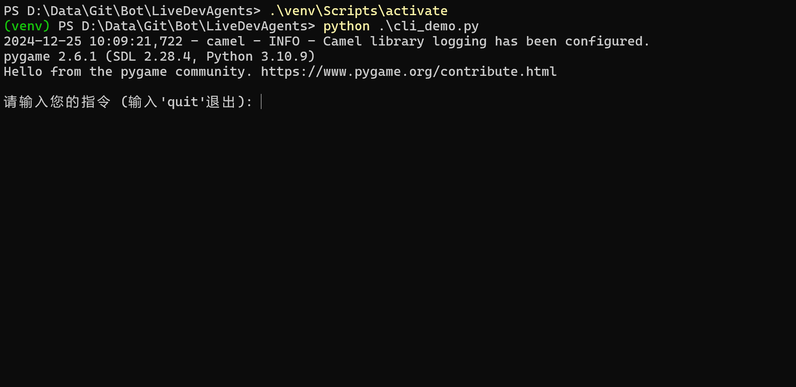

# Multi-Agent danmaku game engine

本项目使用[CAMEL](https://github.com/camel-ai/camel)构建。2024.12 CAMEL-AI Hackathon项目。

使用多个不同专长Agent组成专家团队，将简单想法进行扩充、拆解、输出、实现，实时更新运行并自迭代纠错。
可在直播时由弹幕实时命令生成游戏，并与AI主播进行互动。

<div style="text-align: center;">
    
    <figcaption>直播画面</figcaption>
    <video height="500" controls>
      <source src="https://sns-video-bd.xhscdn.com/stream/79/110/4/01e76ae9002da1340103700393f9c05aff_4.mp4 " type="video/mp4">
    </video>
    <figcaption>视频介绍</figcaption>
</div>


Developers: [Rex](https://space.bilibili.com/24628962/), [SleeeepyZhou](https://space.bilibili.com/360375877), [Stargaze](https://space.bilibili.com/453898404)

## Todo

- [ ] 完善workforce，以处理信息噪声，给出更有效信息
- [ ] 迁移主播Agent，目前仍在使用旧框架
- [ ] 完善弹幕处理逻辑
- [ ] 完善直播中控，支持更多平台
- [ ] 接入美术、音乐等Agent
- [ ] VR共享工作空间，多人讨论，自动开发

## Start

克隆仓库
`git clone https://github.com/SleeeepyZhou/LiveDevAgents.git`

安装依赖，建议使用虚拟环境
```
cd LiveDevAgents
python -m venv venv
pip install -r requirements.txt
```

请将此json文件内容对应键值改为自己的apikey，并将文件改名为`key.json`

<div style="text-align: center;">
  
</div>

### CLI demo

安装完成后`python cli_demo.py`可以直接使用命令行直接使用。

<div style="text-align: center;">
  
</div>

### Gradio demo

<div style="text-align: center;">
  
</div>

配置好环境后，先启动`programmer.py`，再启动`gradio_demo.py`。

### Blive

直播中控由Godot构建，使用[BliveChat](https://github.com/xfgryujk/blivechat)项目抓取弹幕。BliveChat 的弹幕转发插件，位于`./contorl/relay_plugin`，详细请见[直播中控](./contorl/readme.md)。

##### 仍在开发中

<div style="text-align: center;">
  
</div>
