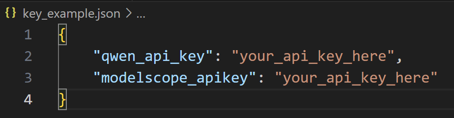
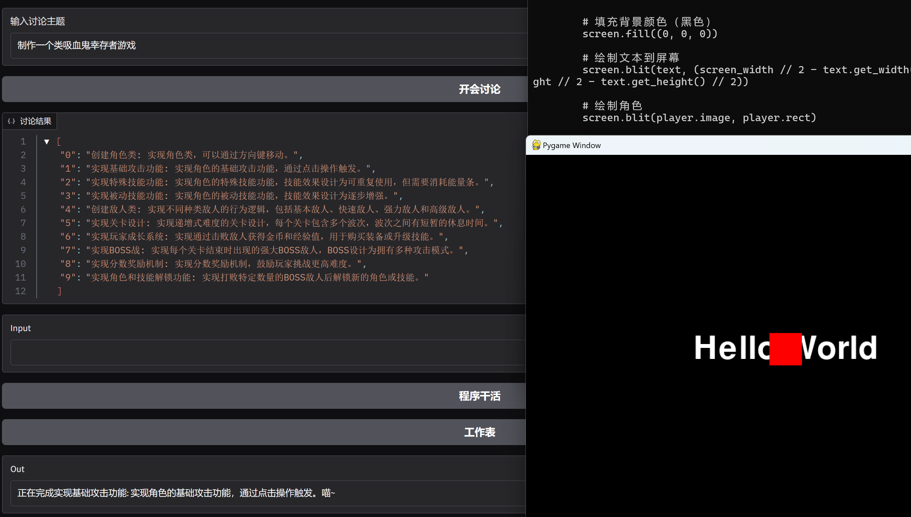
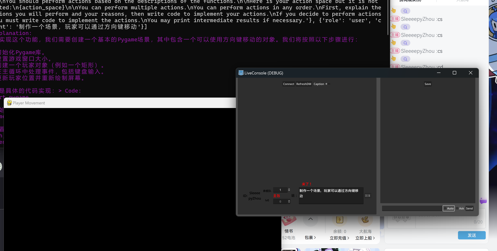

# Agent 弹幕游戏开发引擎

本项目使用[CAMEL](https://github.com/camel-ai/camel)构建。2024.12 CAMEL-AI Hackathon项目。

Developers: [Rex](https://space.bilibili.com/24628962/), [SleeeepyZhou](https://space.bilibili.com/360375877), [Stargaze](https://space.bilibili.com/453898404)

## Todo

- [ ] 完善workforce，以处理信息噪声，给出更有效信息
- [ ] 完善直播中控，支持更多平台
- [ ] 迁移主播Agent，目前仍在使用旧框架
- [ ] 完善弹幕处理逻辑

## Start

克隆仓库
`git clone https://github.com/SleeeepyZhou/LiveDevAgents.git`

安装依赖
`cd LiveDevAgents`
`pip install -r requirements.txt`

请将此json文件内容对应键值改为自己的apikey，并将文件改名为`key.json`

### Gradio demo

配置好环境后，先启动`programmer.py`，再启动`gradio_demo.py`。

### Blive

直播中控由Godot构建，使用[BliveChat](https://github.com/xfgryujk/blivechat)项目抓取弹幕。BliveChat 的弹幕转发插件，位于`./contorl/relay_plugin`，详细请见[直播中控](./contorl/readme.md)。

##### 仍在开发中

